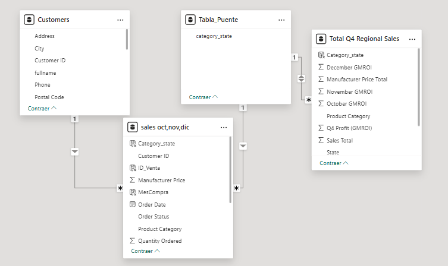

## Análisis de Ventas Trimestrales en Power BI

Este proyecto presenta un análisis de las ventas trimestrales de una base de datos para los meses de octubre,noviembre y diciembre mediante el sofware Power BI. Se exploran tendencias de ventas, segmentación por productos y clientes, se muestran graficos e indicadores claves  que se destacan en el informe.

## Fuentes de Datos y Recolección

Los datos se obtuvieron de un archivo excel de un curso de Power Bi de cousera."conjuntos de datos para practicar,sin resolver"

*Los datos se exportaron de un archivo XLSX y se integraron en Power BI mediante Power Query.*

## Objetivos

- **Analizar** la evolución de las ventas por mes.
- **Identificar** productos y clientes que aportan mayor y menor ingreso.
- **Evaluar** los indicadores claves de las ventas,productos y clientes.

**Motivacion** identificar informacion relevante para la empresa,lo cual se pueda analizar tendencias de ventas,preferencias de los clientes,segmentacion de productos.

**Metodología y Proceso de Trabajo**
- Cuando se conecta la base de datos a Power Bi,en la previsualización se observa que hay tablas con diferentes nombres,pero con la misma información de otras tablas,por algún error en la creación de su estructura.Se eliminaron las tablas duplicadas y nos quedamos solo con las necesarias para trabajar.
- transformamos los datos en Power Query.En la tabla clientes,eliminamos columnas que no se relacionan con el cliente,como atributos del producto,información que debería ir en la tabla de ventas.Combinamos el nombre del cliente,que esta en diferentes columnas su nombre y apellido,las únimos para crear el nombre completo por cliente,con el objetivo de reducir información y generar consultas eficientes.
- Cambiamos los tipos de datos como el id_cliente en formato texto,pues de tipo númerico no nos interesa ya que no es para realizar cálculos.La columna feha tipo texto,la cambiamos a tipo fecha y creamos una columna nueva que nos extraiga,solo el mes respectivo de compra para posteriores análisis por mes.
- La clave principal de las tablas en este caso cliente id,como identificador único,vemos que hay dúplicados,lo cual no debería existir y generamos la columna de valores únicos.
- En este caso no hay valores faltantes en las filas,por lo que no es necesario ningúna limpieza de este tipo.
- Juntamos las tablas de ventas separadas de octubre,noviembre y diciembre en una,con el fin de facilitar los análisis y mejorar el rendimiento del modelo.
  
**Modelos relacionales**
- Después de eliminar las tablas duplicada nos quedamos con cuatro tablas para trabajar:
- 
   -La tabla de clientes con su columna de  identificador único llamada customers ID,para conectar con la tabla de ventas de los tres meses.En la tabla sales oct,nov,dic;creamos una columna llamada ID_Venta de valores Únicos,con su identificación única y combianciones únicas de  su categoria y estado donde se adquirió el producto,para poder relacionar diferentes  atributos de la tabla sales oct,nov y dic y la tabla Total Q4 Regional Sales,con la tabla clientes"Customers".
  
   -Construimos una tabla puente,con una columna Única y de valores únicos llamada category_state,creada con la combinación de las columnas  de categoría del producto y su estado geográfico donde se realizó la compra,con el fin de generar valores Únicos y conectarlas.

    

  
  
  

